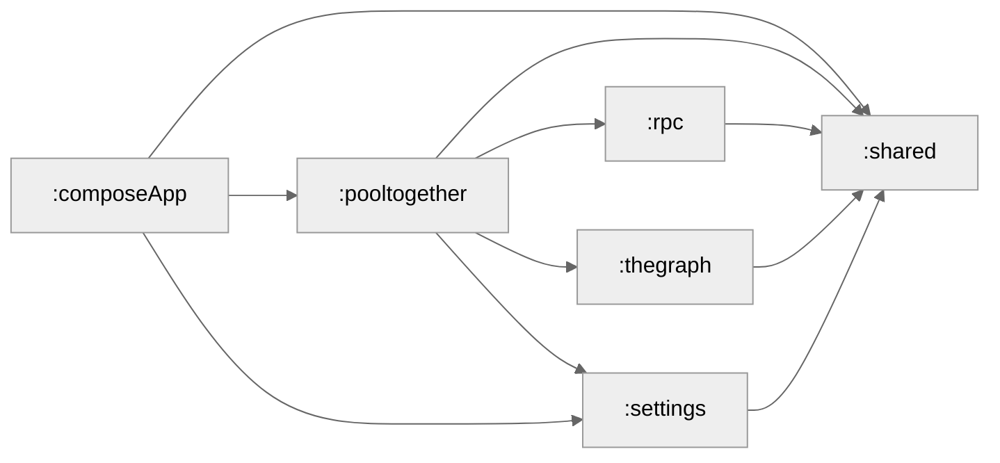

Pooly is an Android application designed for the [PoolTogether](https://pooltogether.com) decentralized finance (DeFi) ecosystem. 
It serves as a mobile dashboard for interacting with "no-loss" prize savings protocols across multiple blockchain networks.

### Core features
- Multi-Network Dashboard: Track savings and prizes across different EVM-compatible chains (Ethereum, Arbitrum, Optimism).
- Vault Analytics: Real-time monitoring of PoolTogether vaults, balances, and participation history.
- Smart Automation: Background synchronization that keeps users updated on the latest prize distributions.
- Notifications: Notify users if tracked address are in the latest prize distributions

## Android

### Build and Run Android Application

To build and run the development version of the Android app, use the run configuration from the run widget
in your IDE’s toolbar or build it directly from the terminal:
- on macOS/Linux
  ```shell
  ./gradlew :composeApp:assembleDebug
  ```
- on Windows
  ```shell
  .\gradlew.bat :composeApp:assembleDebug
  ```

## Server

### Build and Run Server

- on macOS/Linux
  ```shell
  ./gradlew :server:runDocker --no-configuration-cache
  ```

### Module Graph

