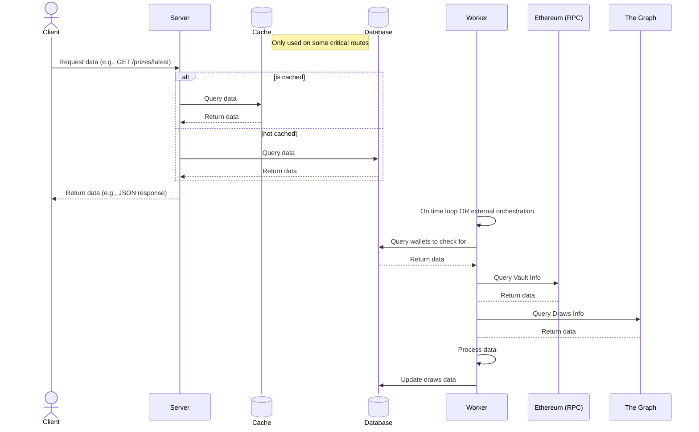
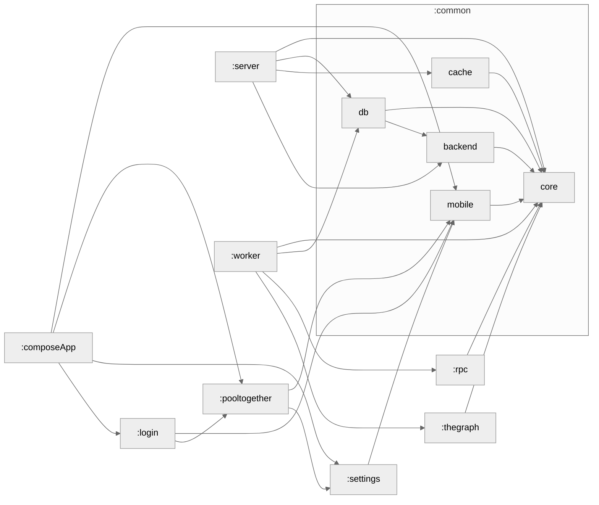

# Pooly

> [!IMPORTANT]
> This is essentially a **playground project** for experimentation with modern Android development (Compose, KMP), backend services (Ktor), and the PoolTogether ecosystem. It is not intended for production use.

Pooly is an Android application designed for the [PoolTogether](https://pooltogether.com)
decentralized finance (DeFi) ecosystem.
It serves as a mobile dashboard for interacting with "no-loss" prize savings protocols across
multiple blockchain networks.

### Core features

- Multi-Network Dashboard: Track savings and prizes across different EVM-compatible chains (
  Ethereum, Arbitrum, Optimism).
- Vault Analytics: Real-time monitoring of PoolTogether vaults, balances, and participation history.
- Smart Automation: Background synchronization that keeps users updated on the latest prize
  distributions.
- Notifications: Notify users if tracked address are in the latest prize distributions

## Android

### Build and Run Android Application

To build and run the development version of the Android app, use the run configuration from the run
widget
in your IDE’s toolbar or build it directly from the terminal:

- on macOS/Linux
  ```shell
  ./gradlew :composeApp:assembleDebug
  ```
- on Windows
  ```shell
  .\gradlew.bat :composeApp:assembleDebug
  ```

## Server



### Build and Run Server

- on macOS/Linux
  ```shell
  ./gradlew :server:runDocker --no-configuration-cache
  ```

### Docker compose

- on macOS/Linux
  ```shell
  ./gradlew :server:jibDockerBuild :worker:jibDockerBuild
  docker-compose -f docker-compose.yml up
  ```

## Testing

### User setup

For now, we're using a default user or local testing across the mobile & server, to set it up add
these values
in you `local.properties` file:
``
pooly.user=YOUR-USERNAME
pooly.password=YOUR-PASSWORD
``

If you're using IJHTTP for the api testing you should create a private env file
`config/ijhttp/http-client.private.env.json` and
add:
``
{
  "local": {
    "user": "YOUR-USERNAME",
    "password": "YOUR-PASSWORD"
    "admin_api_key": "DEFAULT-ADMIN-API-KEY"
  }
}
``

### Alchemy key

To access an Ethereum RPC, we're using [Alchemy](https://www.alchemy.com/). You need to get a free
api key to allow the worker to access the RPC.

Once created, just add this to your `local.properties` file :
``
alchemy.key=YOUR-ALCHEMY-KEY
``

### Get test addresses

In order to test the application without random addresses that would not return any data with
the protocol, we need to get addresses of new winners. To do so, you can go on
the [cabana.fi](https://app.cabana.fi)
frontend and look at any vault on Base (only chain supported for now). For
example https://app.cabana.fi/vault/8453/0x4e42f783db2d0c5bdff40fdc66fcae8b1cda4a43 .
On the page you should be able to find addresses of the latest winners that you can use to test the
application whether on the frontend or the backend.

### Module Graph

